# Adding social sign in to your Django web application using FusionAuth


In this tutorial, we’ll build a basic Django web application which does user registration and authentication via [FusionAuth](https://fusionauth.io/), an authentication platform with some unique features.

The application itself will be very simple: it will let users put in their birthdays and keep this “secret” information safe for them, but with these basics in place, you’ll see how FusionAuth works and can extend the application to do whatever you need.

## What do you need to follow this tutorial?

We’ll explain nearly everything that we use, but we expect you to have:
-   Basic Python knowledge and a Python environment set up
-   Preferably basic Django knowledge (or knowledge of a similar web framework such as Flask)
-   Docker and Docker-Compose set up as we’ll set up FusionAuth using these.
    
It’ll also help if you know the basics of OAuth or authentication in general.

## Why FusionAuth?

Django has a mature authentication system by default, but it isn’t perfect. For example, “social login” (the “log in with Google/Facebook/GitHub/Twitter” functionality) isn’t handled by Django by default. You can use the [django-all-auth](https://django-allauth.readthedocs.io/en/latest/) package to add this, but now you’re already adding complexity to your project. Soon you’ll want to add more functionality, such as resetting passwords, forgotten passwords, and more.

Nearly every web app needs authentication and authentication is more complicated than it seems at first. Therefore, it’s a great time to follow the [Single Responsibility Principle](https://en.wikipedia.org/wiki/Single-responsibility_principle) - instead of trying to build out your own authentication and authorization functionality, delegate this to a project whose only job is handling authentication.

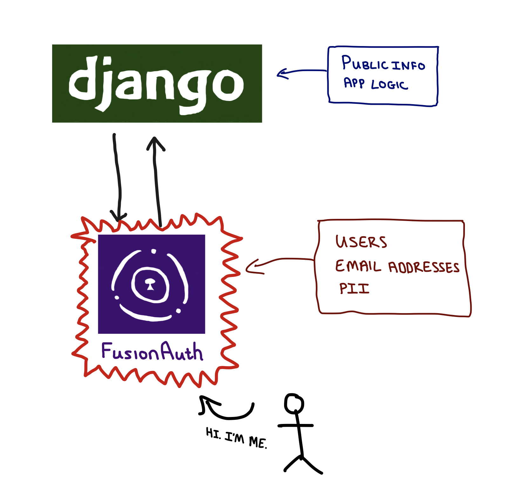

The image above shows how this works. Your application logic and all public information can be handled by Django. Anything sensitive, such as personally identifiable information (PII) is handled by FusionAuth.

This means that you can focus a majority of your security efforts on FusionAuth. It also means that if you create more applications, they can piggy-back on your centralised authentication instead of having to re-implement authentication for each and every application that you build.

Any integrations that you set up with other providers (e.g. Google for “Sign in with Google”) can be done once, instead of per application too.

## Installing and configuring FusionAuth

There are [various ways](https://fusionauth.io/docs/v1/tech/installation-guide/fusionauth-app) to install FusionAuth depending on your system, but the easiest way is to use Docker and Docker Compose. The updated containers and instructions are at [https://github.com/FusionAuth/fusionauth-containers/](https://github.com/FusionAuth/fusionauth-containers/). Currently, to install and run FusionAuth you would run (assuming you have Docker installed).

```bash
curl -o docker-compose.yml https://raw.githubusercontent.com/FusionAuth/fusionauth-containers/master/docker/fusionauth/docker-compose.yml
https://raw.githubusercontent.com/FusionAuth/fusionauth-containers/master/docker/fusionauth/docker-compose.override.yml
curl -o .env https://raw.githubusercontent.com/FusionAuth/fusionauth-containers/master/docker/fusionauth/.env
docker-compose up

```

Note that this uses a public `.env` file containing hard-coded database passwords and is not suitable for production use.

### Configuring FusionAuth

FusionAuth should now be running and reachable on `[http://localhost:9011](http://localhost:9011)`. The first time you visit, you’ll be prompted to set up an admin user and password. Once you’ve done this, you’ll be prompted to complete three more set up steps, as shown below.


We’ll skip step **#3** in this tutorial, but sending emails (e.g. to verify email addresses and do password resets) is a vital part of FusionAuth running in production.

### Creating an Application

Click “Setup” under “Missing Application” and call your new app “Secret Birthdays”. It’ll get a Client Id and Client secret automatically. Later, we’ll set up a Django application which will run on [http://localhost:8000](http://localhost:8000), so configure the Authorized URLs accordingly. You should add:

- [http://localhost:8000/dashboard](http://localhost:8000/dashboard) to the Authorized redirect URLs
- [http://localhost:8000/](http://localhost:8000/) to the Authorized request origin URL
- [http://localhost:8000/](http://localhost:8000/) to the Logout URL
  
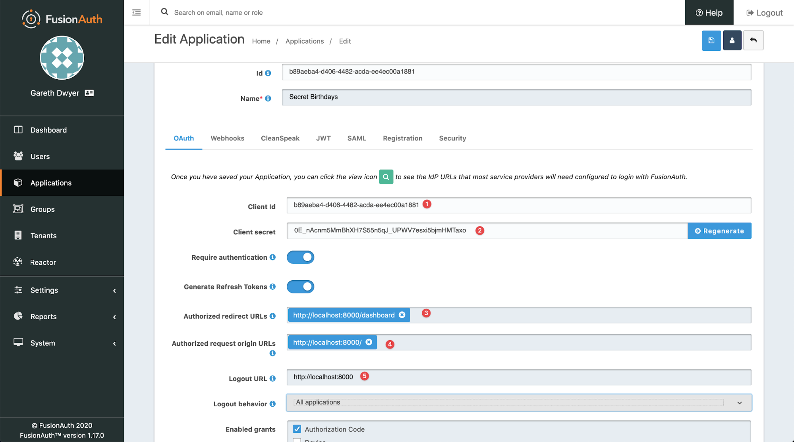

While you’re here, turn on “Self service registrations” which will allow our users to sign themselves up for our application.

Under the registration tab, toggle Self service registration to “Enabled”.

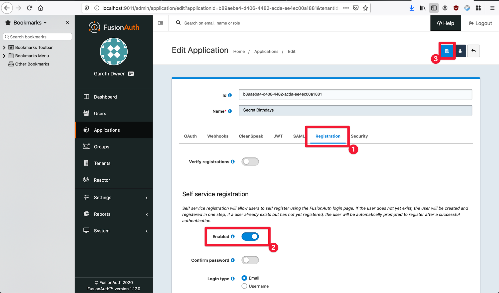
Click the Save button in the top right for your changes to take effect.

### Creating an application in the Google Developers Console

In order to allow our users to sign in to our app using their Google account, you’ll need to set up a Google Cloud project and get an OAuth ID and secret. The full instructions for doing this are available [here](https://fusionauth.io/docs/v1/tech/identity-providers/google).

Use [http://localhost:9011](http://localhost:9011) for the authorized JavaScript origin and Authorized redirect URI. This will allow our FusionAuth app to talk to Google’s servers and have them authenticate users on our behalf, as shown below.

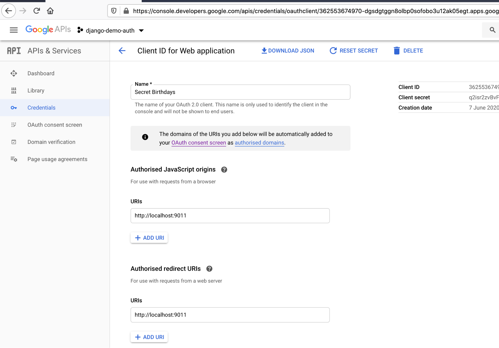

Note that with a sandbox application, which is created by default, you can only sign up a maximum of 100 users. For production use, you need to make sure that you have pages describing your privacy policy and get approval from Google, which you’ll be prompted to do during the setup process.

Once you’ve set up everything in the Google Console, you’ll need to complete the set up by adding Google as an identity provider to FusionAuth and copying in the ClientID and Client Secret that you got from Google. The detailed steps for this are also described [here](https://fusionauth.io/docs/v1/tech/identity-providers/google).

In the next step, make sure that you have enabled the Google integration and turn on “Create registration” for your Secret Birthday’s app. Also don’t forget to hit the save button.

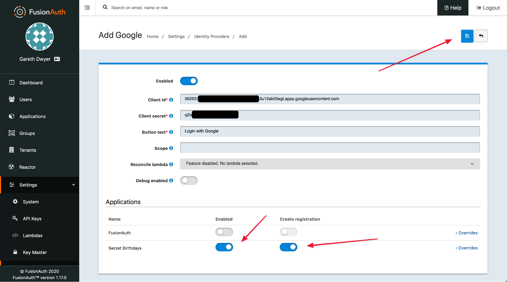

Finally, turn on “self service registration” to allow users to sign up for the application (otherwise you would have to register each one manually) and save the page.

Now we’ve done most of the admin. Let’s build a Django app!

## Setting up Django

To get started, you should:
-   Create a virtual environment for your project
-   Activate it
-   Install Django, dateparser, and the FusionAuth Python client
-   Create the secretbirthdays Django project
-   Create the secretbirthdaysapp Django app inside this project
-   Run the initial migrations
-   Start the Django development server

The commands to complete all of the above are shown below.

```bash
virtualenv sb-env
Source sb-env/bin/activate
pip3 install django dateparser fusionauth-client
django-admin startproject secretbirthdays
cd secretbirthdays
python3 manage.py startapp secretbirthdaysapp
python3 manage.py makemigrations
python3 manage.py migrate
python3 manage.py runserver
```

If all went well, the server should start successfully, as shown below.


And if you visit [`http://localhost:8000`](http://localhost:8000) in your web browser, you should see the default Django page

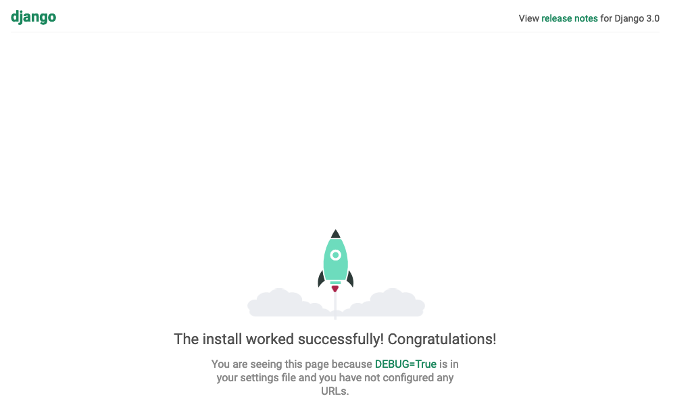

## Building the Secret Birthdays Application

Our application will only have three pages, including the FusionAuth login page.

1.  A home page - a public page showing how many users our app has an inviting users to log in
2.  The log in / sign up page (on FusionAuth) with options to use a username/password or to sign in with Google
3.  A logged in private “dashboard” page, unique per user. This will display the user’s birthday if we have it on record, or allow them to add or change their birthday. It will also let users log out.

First, let’s tell Django that our secretbirthdaysapp is going to be the main app of our secretbirthdays project. In the secretbirthdays/urls.py file, add `path('', include('secretbirthdaysapp.urls')),` to the urlpatterns array and import Django’s `include()` function.

The full file should look as follows.

```python
from django.contrib import admin
from django.urls import path, include

urlpatterns = [
    path('', include('secretbirthdaysapp.urls')),
    path('admin/', admin.site.urls),
]
```

Now we can create the home page. It will look like this.

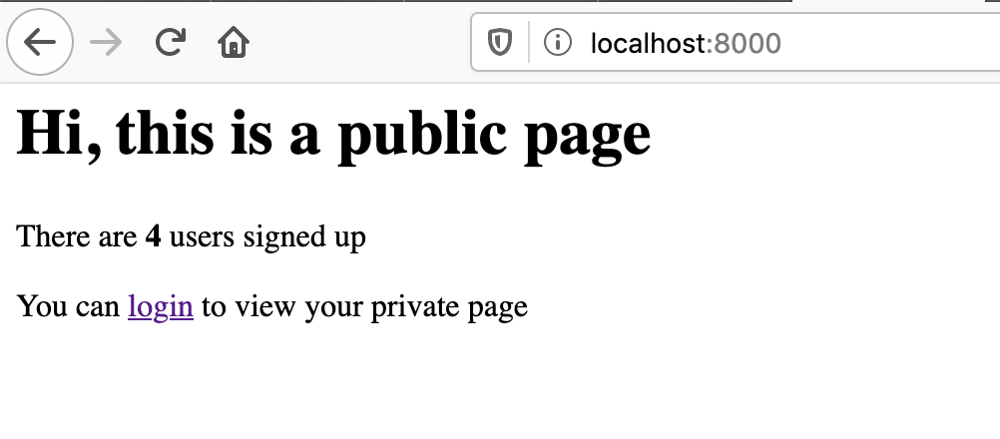


In the secretbirthdaysapp directory create a folder called templates, and a folder called secretbirthdaysapp inside that (this is a Django convention to stop templates with the same name in different apps conflicting.

Now create the file `secretbirthdaysapp/tempaltes/secretbirthdaysapp/home.html` and add the following code.

```html
<html>
   <head>
      <title>My Django Application</title>
   </head>
   <body>
      <h1>Hi, this is a public page</h1>
      <p> There are <b>{{num_users}}</b> users signed up </p>
      <p>You can <a href="{{login_url}}">login</a> to view your private page</p>
   </body>
</html>
```

We will still need to pass the variables `num_users` and `login_url` to this template from the backend.

In `secretbirthdaysapp/views.py` import `View`, `User`, and add a `HomeView` to render our home page.
```python
from django.contrib.auth.models import User
from django.shortcuts import render
from django.views.generic import View

class HomeView(View):

    def get(self, request):
        num_users = User.objects.count()
        login_url = ""
        return render(
            request,
            "secretbirthdaysapp/home.html",
            {"login_url": login_url, "num_users": num_users},
        )
```

Finally, register our app in the project-level settings.py file secretbirthdays/settings.py. Add `secretbirthdaysapp` to `INSTALLED_APPS`. The full definition should look as follows.

```python
INSTALLED_APPS = [
    'django.contrib.admin',
    'django.contrib.auth',
    'django.contrib.contenttypes',
    'django.contrib.sessions',
    'django.contrib.messages',
    'django.contrib.staticfiles',
    'secretbirthdaysapp',
]
```

If you fire up [http://localhost:8000](http://localhost:8000) in your web browser now, you should see our home page.

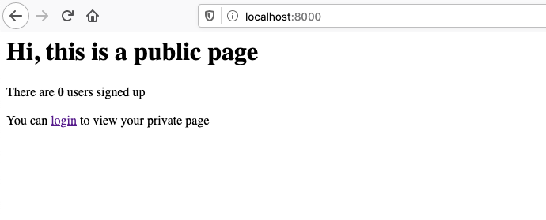

To build the login URL (which will direct users to our FusionAuth server), we need to have some of our FusionAuth config copied across to our Django project. Specifically, we’ll need an API key and our app’s client ID.

Go back to the FusionAuth dashboard ([http://localhost:9011](http://localhost9011)) and complete the next piece of set up.

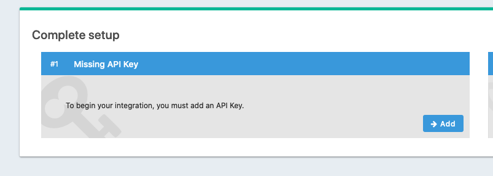

Add a name for the key, take note of the generated Key. For extra security, you can restrict the permissions for the key. For our app, we only need to enable the actions for `/api/user/`, which will let the key carry about basic actions on users. If you leave the key with no explicitly assigned permissions, it will be an all-powerful key that can control all aspects of your FusionAuth app.

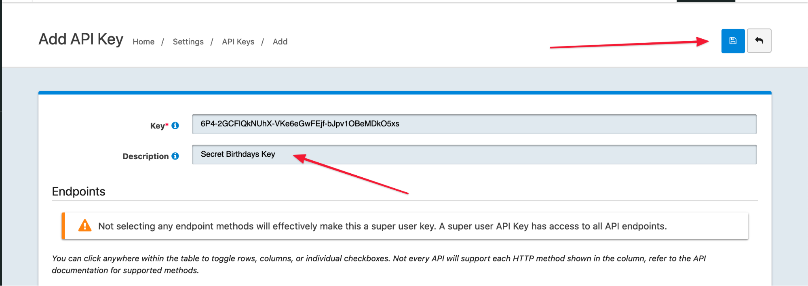

Under Applications, click on the green magnifying glass by "Secret Birthdays" and take note of the Application ID and Client Secret. You need to scroll down a bit in the modal to get to the correct section

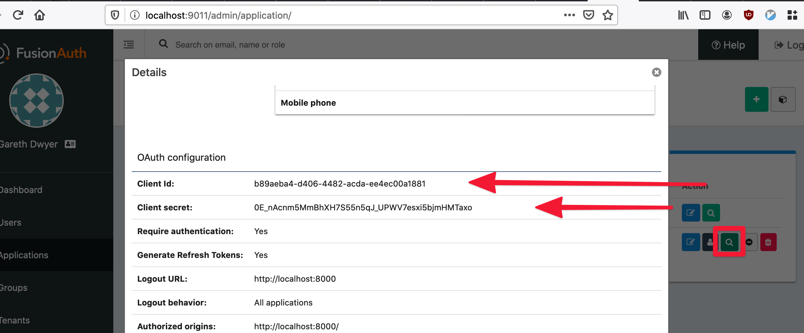

Now, in secretbirthdays/settings.py add these values as variables, at the bottom of the file (you’ll need to change the random-looking strings for your own Application’s ID and API key).

```python
FUSION_AUTH_APP_ID = "b89aeba4-d406-4482-acda-ee4ec00a1881"
FUSION_AUTH_CLIENT_SECRET = "0E_nAcnm5MmBhXH7S55n5qJ_UPWV7esxi5bjmHMTaxo"
FUSION_AUTH_API_KEY = "n6z-UA9UR_8RfXF0p5kWI5doOqYZiXUaG2MwenCBFDY"
FUSION_AUTH_BASE_URL = "http://localhost:9011"
```

## Allowing users to sign up and log in

Now for the fun part: let’s allow users to sign up for our application to view their own personal dashboards.
  
Create a new template in `secretbirthdaysapp/templates/secretbirthdaysapp/dashboard.html` and add the following code.

```html
<html>
   <head>
      <title>SUPER PRIVATE INFO!!</title>
   </head>
   <body>
      <h1>This is private information (<a href="">Logout</a>)</h1>
      <p>You are logged in as {{request.user.username}}</p>
      
      <font color="red">
         <h3>{{message}}</h3>
      </font>
      
      <p>Your birthday is {{birthday}}</p>
      <p>Please enter your birthday</p>
      <form action="/dashboard" method="POST">
         
         <input type="text" name="birthday" placeholder="When were you born">
         <input type="Submit" value="SEND">
      </form>
   </body>
</html>
```

This template still needs some variables, namely the user’s birthday (if we have it) and any messages based on their input. We also need to connect it to a URL and make the /logout URL meaningful)

Add URLs for the dashboard and to logout in the secretbirthdaysapp/urls.py file. The whole file should look like this.

```python
from django.urls import path
from . import views

urlpatterns = [
    path('', views.HomeView.as_view(), name='home'),
    path('dashboard', views.DashboardView.as_view(), name='dashboard'),
    path('logout', views.LogoutView.as_view(), name='logout'),
]
```
Update the `secretbirthdaysapp/views.py` to account for these new routes.

1.  Add imports for our settings, the `FusionAuthClient`, and Django’s shortcuts. Your imports section should look as follows.

```python
from django.conf import settings
from django.contrib.auth.models import User
from django.shortcuts import render, redirect, reverse
from django.views.generic import View

from fusionauth.fusionauth_client import FusionAuthClient
```
2.  Add the Dashboard view

```python
class DashboardView(View):

    def get(self, request):
        if not user_login_ok(request):
            login_url = get_login_url(request)
            return redirect(login_url)

        birthday = None
        user = None

        try:
            client = FusionAuthClient(
                settings.FUSION_AUTH_API_KEY, settings.FUSION_AUTH_BASE_URL
            )
            r = client.retrieve_user(request.user.username)

            if r.was_successful():
                user = r.success_response
                birthday = user["user"]["birthDate"]
            else:
                print(r.error_response)
        except Exception as e:
            print("couldn't get user")
            print(e)

        return render(request, "fusiondemoapp/dashboard.html", {"birthday": birthday})
```
Here we check if the user can log in (functionality we still have to write). If everything looks OK, we retrieve the user’s birthday from FusionAuth (which it doesn’t have by default as we don’t get this information from Google or when the user registers).

3.  Add the Logout view

```python
class LogoutView(View):

    def get(self, request, *args, **kwargs):
        redirect_url = request.build_absolute_uri("home")
        url = f"{settings.FUSION_AUTH_BASE_URL}/oauth2/logout?client_id={settings.FUSION_AUTH_APP_ID}"
        return redirect(url)
```

4.  Add the get_or_create user function near the top of views.py
  
```python
def get_or_create_user(user_id, request):
    user = User.objects.filter(username=user_id).first()

    if not user:
        user = User(username=user_id)
        user.save()

    return user
```

This looks for a Django user using FusionAuth’s user_id as the username. If it doesn’t exist, we create it and save it to the database. Note that now in our Django application we will only keep really basic User objects, with nothing but a randomly generated ID to identify them - all sensitive PII and passwords are handled only by FusionAuth.

We also need to build a fairly long URL to log in with FusionAuth. Add another helper function for this, as follows.

```python
def get_login_url(request):
    redirect_url = request.build_absolute_uri(reverse("dashboard"))
    login_url = f"{settings.FUSION_AUTH_BASE_URL}/oauth2/authorize?client_id={settings.FUSION_AUTH_APP_ID}&redirect_uri={redirect_url}&response_type=code"

    login_url = login_url.format(
        settings.FUSION_AUTH_BASE_URL, settings.FUSION_AUTH_APP_ID,
    )
    return login_url
```
We’ll build this using variables as the components would differ between local, staging, and production setups. We tell Django where to find our FusionAuth app, which App ID to authenticate with, and where FusionAuth should redirect the user once log in is completed.
 
Now add a helper function to check if everything went OK with the users log in. This is the fairly complex OAuth dance that proves identity in several steps.

```python
def user_login_ok(request):
    client = FusionAuthClient(
        settings.FUSION_AUTH_API_KEY, settings.FUSION_AUTH_BASE_URL
    )

    code = request.GET.get("code")

    if not code:
        print("no code")
        return False

    try:
        redirect_url = request.build_absolute_uri(reverse("dashboard"))
        r = client.exchange_o_auth_code_for_access_token(
            code,
            redirect_url,
            settings.FUSION_AUTH_CLIENT_ID,
            settings.FUSION_AUTH_CLIENT_SECRET,
        )

        if r.was_successful():
            access_token = r.success_response["access_token"]
            user_id = r.success_response["userId"]
            get_or_create_user(user_id, request)
            return user_id
        else:
            print(r.error_response)
            return False

    except Exception as e:
        print(e)
```

Now after the user presses log in, they'll be taken over to the FusionAuth page where they can log in or create an account (if they choose the log in with Google option, the log in and sign up flows are the same).

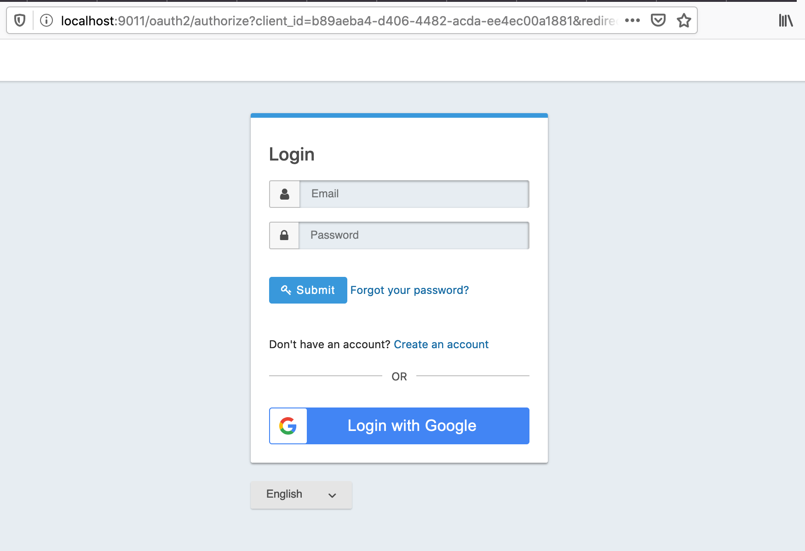

If it's important to you that your log in page shares a look and feel with the rest of your application, FusionAuth allows you to fully customise this page using [FusionAuth themes](https://fusionauth.io/docs/v1/tech/themes/), but doing so is left as an exercise for the reader.

After the user is directed back to the /dashboard route from FusionAuth (after logging in), they’ll bring a “Code” with them. This is what FusionAuth gave them in return for completing a successful log in. As this code is semi public (available in the URL), we don’t trust it completely. Instead we use this code to check with FusionAuth directly by exchanging it for an oauth token, which tells us which user the code was given to.


If everything goes well, the user is allowed to see the “secret” dashboard. Of course, we still don’t actually know the user’s birthday, so we have to ask them. At the moment, we aren’t collecting the information in the form, so let’s add the `post()` function in our dashboard view to do that.

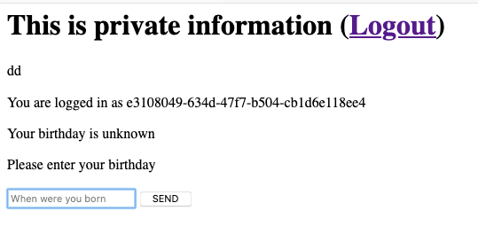

## Allowing the user to enter their birthday

As our Django app has a database by default, we could simply store the users birthday in there. But remember, we want to keep any sensitive data within FusionAuth rather, so our Django app wants to touch this information as little as possible and not store it.

Therefore, the moment we get info from the user, Django will send it across to FusionAuth for safe-keeping and not keep its own record.

Add `import dateparser` at the top of secretbirthdayapp/views.py.

Now add the following function to the DashboardAppView class in secretbirthdaysapp/views.py

```python
def post(self, request):

    birthday = request.POST.get("birthday")
    normalised_birthday = None
    print(birthday)

    try:
        dt = dateparser.parse(birthday)
        normalised_birthday = dt.strftime("%Y-%m-%d")
    except Exception as e:
        print(e)
        print("Couldn't parse birthday")

    if not normalised_birthday:
        return render(
            request,
            "fusiondemoapp/dashboard.html",
            {"message": "Couldn't parse birthday. Please use YYYY-MM-DD"},
        )

    try:
        client = FusionAuthClient(
            settings.FUSION_AUTH_API_KEY, settings.FUSION_AUTH_BASE_URL
        )
        r = client.patch_user(
            request.user.username, {"user": {"birthDate": normalised_birthday}}
        )
        if r.was_successful():
            print(r.success_response)
            return render(
                request,
                "secretbirthdaysapp/dashboard.html",
                {"message": "Updated your birthday", "birthday": normalised_birthday,},
            )

        else:
            print(r.error_response)
            return render(
                request,
                "fusiondemoapp/dashboard.html",
                {"message": "Something went wrong"},
            )

    except Exception as e:
        print(e)
        return render(
            request,
            "secretbirthdaysapp/dashboard.html",
            {"message": "Something went wrong"},
        )

```

Here, if the user submits a birthday, we try to parse it into a date. The dateparser module is pretty good at understanding different date formats (e.g “1 Jan 90”, “Jan 1 1990”, “1/1/1990”, etc), while FusionAuth needs the date in a specific format (“1990-01-01”). Therefore, we attempt to parse whatever the user gave us into a date, reformat it, and then send it across to FusionAuth using the `patch_user` function.

Now you can visit the Django app at [http://localhost:8000](http://localhost:8000), press the link to log in, sign up as a new user using GMail (if you used your main Google account as the “admin” FusionAuth user and want to test this using a new user, then do this through an incognito or private window and sign up with a second Google account.)  

Once you’ve added your birthday, you’ll be able to see it in the dashboard.

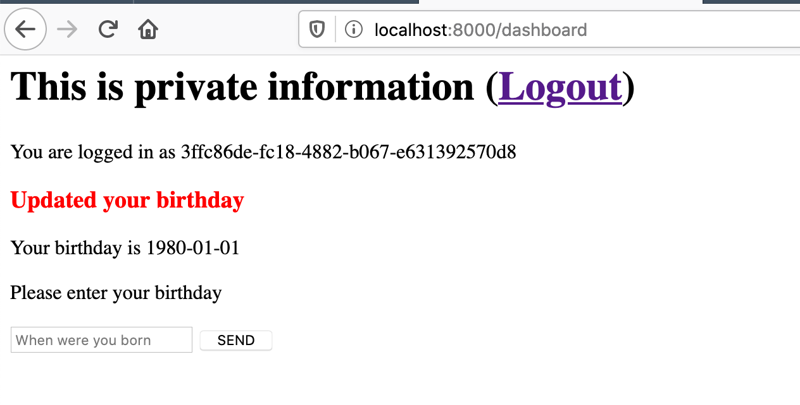

If you log into the FusionAuth app as the main admin user, navigate to users, and select the user that added a birthday, you’ll also be able to see it there (with the user’s age calculated so you don’t have to do the maths yourself).

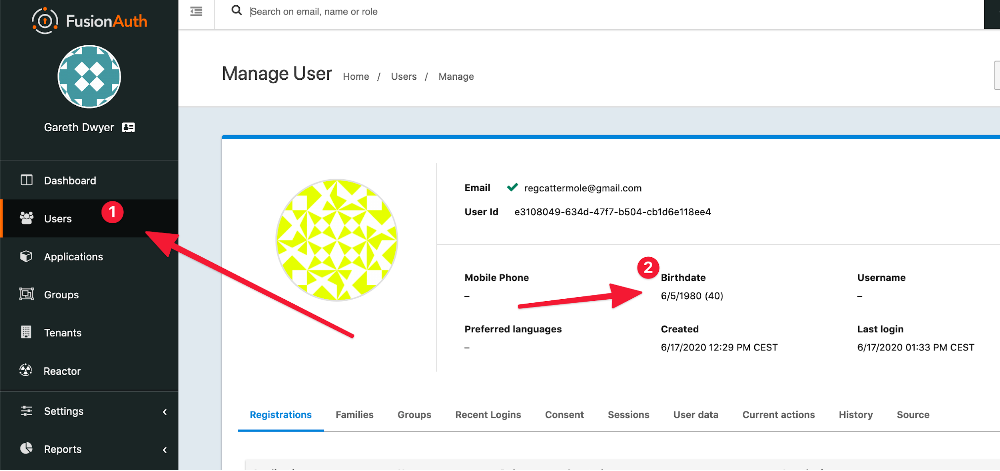

Hitting the big Logout link in the Django app takes you back through FusionAuth, logs you out, and redirects you back to the home page


## Where next?

That’s the basics of our Django app done. The app stores sensitive information such as users’ names (from Gmail) and birthdates (that they enter in our app), but delegates all responsibility for safeguarding and validating this information to FusionAuth.

Of course, you would need to add more interesting features to this app for it to be useful. But any information that stores private information can follow a similar pattern. You could make the app useful by allowing people to store more information, such as journal entries. Or you could allow them to store people's names along with birthdays, and remind them to send good wishes the day before someone's birthday. The possibilities are endless.

For a production set up, you would also need to do a bit more work in making sure FusionAuth was really safe. In our example, we used the default password provided with Docker for our database, left debug mode on, and ran FusionAuth locally, co “hosted” with our Django application.

For a safer set up, you would run FusionAuth on its own infrastructure, physically separate from the Django app, and take more care around production configuration and deployment, but FusionAuth gives you all of the tools to do this easily.

